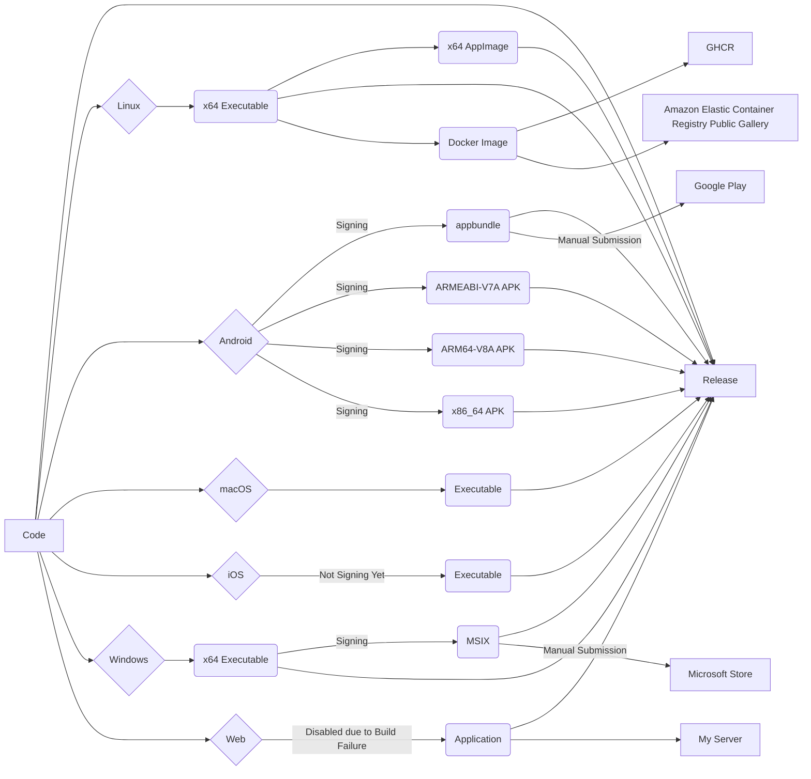

<div align="center">
  

# Bitscoper CyberKit

A Flutter application offering Bluetooth Low Energy Scanner, IPv4 Subnet Scanner, mDNS Scanner, UPnP Scanner, Route Tracer, TCP Port Scanner, Pinger, File Hash Calculator, String Hash Calculator, CVSS Calculator, Base Encoder, Morse Code Translator, QR Code Generator, OGP Data Extractor, Series URI Crawler, DNS Record Retriever, WHOIS Retriever, and Wi-Fi Details Viewer.

[](https://github.com/bitscoper/bitscoper_cyberkit/actions/workflows/Build,%20Release,%20and%20Deploy.yaml)

</div>

> [!WARNING]
> Unlawful use is prohibited.

<div align="center">
  <table>
    <tbody>
      <tr>
        <td>
          <a href="https://apps.microsoft.com/detail/9mv2046tz302">
            
          </a>
        </td>
        <td>
          <a href="https://github.com/bitscoper/bitscoper_cyberkit/pkgs/container/bitscoper_cyberkit/">
            
          </a>
        </td>
        <td>
          <a href="http://apps.obtainium.imranr.dev/redirect.html?r=obtainium://add/https://github.com/bitscoper/bitscoper_cyberkit/">
            
          </a>
        </td>
      </tr>
    </tbody>
  </table>
</div>

## [Latest Release](https://github.com/bitscoper/bitscoper_cyberkit/releases/latest/)

### Linux

- **x64 Executable:** [Linux_x64_Executable.zip](https://github.com/bitscoper/bitscoper_cyberkit/releases/latest/download/Linux_x64_Executable.zip)
- **x64 AppImage:** [Bitscoper_CyberKit-18.1.2-x64.AppImage](https://github.com/bitscoper/bitscoper_cyberkit/releases/latest/download/Bitscoper_CyberKit-18.1.2-x64.AppImage)
- **x64 Debug Symbols:** [Bitscoper_CyberKit-Linux_x64.symbols](https://github.com/bitscoper/bitscoper_cyberkit/releases/latest/download/Bitscoper_CyberKit-Linux_x64.symbols)

### Android

Submission to [Google Play](https://play.google.com/store/apps/details?id=bitscoper.bitscoper_cyber_toolbox) is paused because I no longer own the account. [Obtainium](http://apps.obtainium.imranr.dev/redirect.html?r=obtainium://add/https://github.com/bitscoper/bitscoper_cyberkit/) can be used to directly install APKs from the [latest GitHub release](https://github.com/bitscoper/bitscoper_cyberkit/releases/latest/).

- **appbundle:** [Bitscoper_CyberKit.aab](https://github.com/bitscoper/bitscoper_cyberkit/releases/latest/download/Bitscoper_CyberKit.aab)
- **x86_64 APK:** [Bitscoper_CyberKit-x86_64.apk](https://github.com/bitscoper/bitscoper_cyberkit/releases/latest/download/Bitscoper_CyberKit-x86_64.apk)
- **ARM64-V8A APK:** [Bitscoper_CyberKit-ARM64_V8A.apk](https://github.com/bitscoper/bitscoper_cyberkit/releases/latest/download/Bitscoper_CyberKit-ARM64_V8A.apk)
- **ARMEABI-V7A:** [Bitscoper_CyberKit-ARMEABI_V7A.apk](https://github.com/bitscoper/bitscoper_cyberkit/releases/latest/download/Bitscoper_CyberKit-ARMEABI_V7A.apk)
- **APK Checksums:** [APK_Checksums.zip](https://github.com/bitscoper/bitscoper_cyberkit/releases/latest/download/APK_Checksums.zip)
- **Debug Symbols:** [Android_Debug_Symbols.zip](https://github.com/bitscoper/bitscoper_cyberkit/releases/latest/download/Android_Debug_Symbols.zip)

### macOS

- **Executable:** [macOS_Executable.zip](https://github.com/bitscoper/bitscoper_cyberkit/releases/latest/download/macOS_Executable.zip)
- **Debug Symbols:** [macOS_Debug_Symbols.zip](https://github.com/bitscoper/bitscoper_cyberkit/releases/latest/download/macOS_Debug_Symbols.zip)

### iOS

- **Executable:** [iOS_Executable.zip](https://github.com/bitscoper/bitscoper_cyberkit/releases/latest/download/iOS_Executable.zip)
- **ARM64 Debug Symbols:** [Bitscoper_CyberKit-iOS_ARM64.symbols](https://github.com/bitscoper/bitscoper_cyberkit/releases/latest/download/Bitscoper_CyberKit-iOS_ARM64.symbols)

### Windows

- **x64 Executable:** [Windows_x64_Executable.zip](https://github.com/bitscoper/bitscoper_cyberkit/releases/latest/download/Windows_x64_Executable.zip)
- **MSIX**: [Bitscoper_CyberKit.msix](https://github.com/bitscoper/bitscoper_cyberkit/releases/latest/download/Bitscoper_CyberKit.msix)
- **x64 Debug Symbols**: [Bitscoper_CyberKit-Windows_x64.symbols](https://github.com/bitscoper/bitscoper_cyberkit/releases/latest/download/Bitscoper_CyberKit-Windows_x64.symbols)

- **Microsoft Store:** [9MV2046TZ302](https://apps.microsoft.com/detail/9mv2046tz302)

#### WinGet

```powershell
winget.exe install --id "9MV2046TZ302" --exact --source msstore --accept-source-agreements --disable-interactivity --silent --accept-package-agreements --force
```

Versions I submit to the Microsoft Store may vary and be delayed.

### Podman / Docker

Available only on the [GitHub Container Registry](https://github.com/bitscoper/bitscoper_cyberkit/pkgs/container/bitscoper_cyberkit/). The free tier of the [Amazon Elastic Container Registry Public Gallery](https://gallery.ecr.aws/n7r2f3q1/bitscoper/bitscoper_cyberkit/) has expired.

#### Pull Image

```sh
podman pull ghcr.io/bitscoper/bitscoper_cyberkit:latest || docker pull ghcr.io/bitscoper/bitscoper_cyberkit:latest
```

#### Run Container

```sh
podman run -it --rm ghcr.io/bitscoper/bitscoper_cyberkit:latest || docker run -it --rm ghcr.io/bitscoper/bitscoper_cyberkit:latest
```

### Web

- **Web Application:** [Web_Application.zip](https://github.com/bitscoper/bitscoper_cyberkit/releases/latest/download/Web_Application.zip) (Disabled due to Build Failure)

## Tools

### 1. Bluetooth Low Energy Scanner

Scans for nearby Bluetooth Low Energy (BLE), Bluetooth LE, or Bluetooth Smart devices.

### 2. IPv4 Subnet Scanner

Scans for pingable IP addresses from `[].[].[].1` to `[].[].[].254` within a specified subnet.

### 3. mDNS Scanner

Scans for Multicast DNS (mDNS) broadcasts and collects associated service information.

### 4. UPnP Scanner

Scans for Universal Plug and Play (UPnP) broadcasts, including Digital Living Network Alliance (DLNA), and collects associated device information.

### 5. Route Tracer

Traces the route to a target server, showing each hop along the route with its corresponding IP address.

### 6. TCP Port Scanner

Scans Transmission Control Protocol (TCP) ports from 0 to 65535 on a target server and reports the open ports.

### 7. Pinger

Pings a target server and reports the IP address, Time To Live (TTL), and time.

### 8. File Hash Calculator

Calculates Message Digest 5 (MD5), Secure Hash Algorithm 1 (SHA1), Secure Hash Algorithm 224 (SHA224), Secure Hash Algorithm 256 (SHA256), Secure Hash Algorithm 384 (SHA384), and Secure Hash Algorithm 512 (SHA512) hashes of files.

### 9. String Hash Calculator

Calculates Message Digest 5 (MD5), Secure Hash Algorithm 1 (SHA1), Secure Hash Algorithm 224 (SHA224), Secure Hash Algorithm 256 (SHA256), Secure Hash Algorithm 384 (SHA384), and Secure Hash Algorithm 512 (SHA512) hashes of a string.

### 10. CVSS Calculator

Uses Common Vulnerability Scoring System (CVSS) v3.1 to calculate base score of exploitability.

### 11. Base Encoder

Encodes a string into binary (Base2), ternary (Base3), quaternary (Base4), quinary (Base5), senary (Base6), octal (Base8), decimal (Base10), duodecimal (Base12), hexadecimal (Base16), Base32, Base32Hex, Base36, Base58, Base62, and Base64.

### 12. Morse Code Translator

Translates English to Morse code and vice versa.

### 13. QR Code Generator

Generates QR (Quick Response) Code from a string.

### 14. OGP Data Extractor

Extracts Open Graph Protocol (OGP) data of a webpage.

### 15. Series URI Crawler

Crawls webpages generated from a combination of Uniform Resource Identifier (URI) and number series, and lists the available ones.

### 16. DNS Record Retriever

Retrieves Address (A), IPv6 Address (AAAA), Any Record (ANY), Certification Authority Authorization (CAA), Child Delegation Signer (CDS), Certificate (CERT), Canonical Name (CNAME), Delegation Name (DNAME), Domain Name System Key (DNSKEY), Delegation Signer (DS), Host Information (HINFO), IPsec Key (IPSECKEY), Next Secure (NSEC), Next Secure version 3 Parameters (NSEC3PARAM), Naming Authority Pointer (NAPTR), Pointer (PTR), Responsible Person (RP), Resource Record Signature (RRSIG), Start of Authority (SOA), Sender Policy Framework (SPF), Service Locator (SRV), SSH Fingerprint (SSHFP), Transport Layer Security Authentication (TLSA), Well Known Services (WKS), Text (TXT), Name Server (NS), and Mail Exchange (MX) records of a domain name (forward lookup) or an IP address (reverse lookup).

### 17. WHOIS Retriever

Retrieves WHOIS information about a domain name.

### 18. Wi-Fi Details Viewer

Displays details of the currently connected Wireless Fidelity (Wi-Fi) network.

## Compatibility

| Tool | Linux | Android | macOS | iOS | Windows | ~~Web~~ |
| -------- | ------- | --------- | ------- | ----- | --------- | ----- |
| Bluetooth Low Energy Scanner | ✅ | ✅ | ✅ | ✅ | ✅ | ~~✅~~ |
| IPv4 Subnet Scanner | ✅ | ✅ | ✅ | ✅ | ✅ | ~~❌~~ |
| mDNS Scanner | ✅ | ✅ | ✅ | ✅ | ✅ | ~~❌~~ |
| UPnP Scanner | ✅ | ✅ | ✅ | ✅ | ✅ | ~~❌~~ |
| Route Tracer | ❌ | ✅ | ❌ | ✅ | ❌ | ~~❌~~ |
| TCP Port Scanner | ✅ | ✅ | ✅ | ✅ | ✅ | ~~❌~~ |
| Pinger | ✅ | ✅ | ✅ | ✅ | ✅ | ~~❌~~ |
| File Hash Calculator | ✅ | ✅ | ✅ | ✅ | ✅ | ~~✅~~ |
| String Hash Calculator | ✅ | ✅ | ✅ | ✅ | ✅ | ~~✅~~ |
| CVSS Calculator | ✅ | ✅ | ✅ | ✅ | ✅ | ~~✅~~ |
| Base Encoder | ✅ | ✅ | ✅ | ✅ | ✅ | ~~✅~~ |
| Morse Code Translator | ✅ | ✅ | ✅ | ✅ | ✅ | ~~✅~~ |
| QR Code Generator | ✅ | ✅ | ✅ | ✅ | ✅ | ~~✅~~ |
| OGP Data Extractor | ✅ | ✅ | ✅ | ✅ | ✅ | ~~✅~~ |
| Series URI Crawler | ✅ | ✅ | ✅ | ✅ | ✅ | ~~✅~~ |
| DNS Record Retriever | ✅ | ✅ | ❌ | ✅ | ✅ | ~~✅~~ |
| WHOIS Retriever | ✅ | ✅ | ✅ | ✅ | ✅ | ~~❌~~ |
| Wi-Fi Details Viewer | ✅ | ✅ | ✅ | ✅ | ✅ | ~~✅~~ |

## Release Flow



## Using Podman / Docker Locally on Linux

### Build Image

```sh
docker build -t bitscoper_cyberkit .
```

### Run Container on Wayland

```sh
xhost +si:localuser:root && docker run -it --rm -e DISPLAY=$DISPLAY -e WAYLAND_DISPLAY=$WAYLAND_DISPLAY -v /run/user/$(id -u)/wayland-0:/run/user/$(id -u)/wayland-0 -e XDG_RUNTIME_DIR=$XDG_RUNTIME_DIR bitscoper_cyberkit
```

## Development Commands

### ID

```sh
flutter pub run rename setBundleId --targets linux,android,macos,ios,windows,web --value "bitscoper.bitscoper_cyberkit"
```

### Name

```sh
flutter pub run rename setAppName --targets linux --value "Bitscoper_CyberKit"

flutter pub run rename setAppName --targets android,macos,ios,windows,web --value "Bitscoper CyberKit"
```

### Icon

```sh
flutter pub run flutter_launcher_icons
```

### Splash Screen

```sh
flutter pub run flutter_native_splash:create
```

### Localizations

```sh
flutter gen-l10n
```

### Android Keystore

#### Generation

```sh
keytool -genkey -v -keystore ~/Laboratory/Bitscoper_CyberKit/Android\ Key/KeyStore.jks -keyalg RSA -keysize 4096 -validity 10000 -alias Bitscoper_CyberKit
```

#### Conversion to Base64

```sh
base64 ~/Laboratory/Bitscoper_CyberKit/Android\ Key/KeyStore.jks > ~/Laboratory/Bitscoper_CyberKit/Android\ Key/KeyStore.b64
```

## Notes

- I write commit messages in Title Case and past tense, leaving out articles to keep them concise while still showing details.
- I delete previous GitHub Actions runs, except for:
  - **[#3](https://github.com/bitscoper/bitscoper_cyberkit/actions/runs/14313849811):** Last build for web and deployment of the web application to the server
  - **[#57](https://github.com/bitscoper/bitscoper_cyberkit/actions/runs/21337182596):** Last build and push of the Docker image to the Amazon Elastic Container Registry Public Gallery
- I only keep the latest release and the latest container version.
- Versions I submit to the Microsoft Store may vary and be delayed.
- Submission to Google Play is paused because I no longer own the account.
- The free tier of the Amazon Elastic Container Registry Public Gallery has expired, and the container will soon be unavailable.
- Building for the web and deployment is currently disabled due to a build failure.
- I have deleted some commits in the past, but this is unlikely to happen again.
